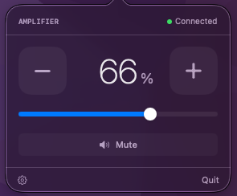

# HA Menubar Volume

[](https://github.com/kevin-klemm/ha-menubar-volume/actions/workflows/build.yml)
[](https://github.com/kevin-klemm/ha-menubar-volume)
[](https://swift.org)
[](LICENSE)

A native macOS menu bar app to control a volume level via Home Assistant — backed by an `input_number` helper for the level and a `switch` for mute.

<p align="center">
  
</p>

## How it works

Mac menu bar → HA REST API + WebSocket → `input_number` (volume) + `switch` (mute)

The app reads and writes directly to your HA entities. What those entities actually control (a receiver, a speaker zone, a media player script, etc.) is up to your own automations.

## Features

- **Menu bar icon** with scroll-to-adjust volume
- **Custom slider** with smooth 80ms debounce (Combine-based)
- **Presets** — Background, Listening, Loud (one-tap)
- **Mute toggle** that remembers your previous level
- **+/− step buttons** for fine 5% adjustments
- **Global hotkey** — ⌥⌘V toggles the popover from anywhere
- **Right-click menu** on the status icon — About, Check for Updates, Quit
- **Settings panel** — configure HA URL, token, and entity IDs without editing code
- **Launch at login** — toggle in Settings to start automatically after a reboot
- **Automatic updates** — built-in [Sparkle](https://sparkle-project.org) updater checks daily and on demand
- **Token stored in the Keychain** — not plaintext UserDefaults
- **Live connection indicator** with error display
- **Syncs state on launch** and stays in sync via WebSocket

## Setup

### 1. Home Assistant side

Create an `input_number` helper for volume (Settings → Helpers → Add → Number, or YAML):

```yaml
input_number:
  volume:
    name: Volume
    min: 0
    max: 1
    step: 0.01
    icon: mdi:volume-high
```

Create a `switch` helper for mute (Settings → Helpers → Add → Toggle, or YAML):

```yaml
input_boolean:
  mute:
    name: Mute
    icon: mdi:volume-off
```

### 2. Generate a Long-Lived Access Token

HA → Your Profile (bottom left) → Long-Lived Access Tokens → Create Token

### 3. Download the app

Download the latest `ha-menubar-volume.dmg` from the [Releases page](https://github.com/kevin-klemm/ha-menubar-volume/releases), open it, and drag **ha-menubar-volume** onto the Applications shortcut.

> **First launch:** macOS may show a security warning since the app isn't notarized. Right-click the app → Open → Open to bypass it once. After that, the built-in updater installs new versions without the warning.

### 4. Configure

Click the gear icon in the popover footer to enter your HA base URL, access token, and entity IDs. Settings persist across launches (the token is kept in the macOS Keychain).

Flip **Launch at login** in the same Settings panel to have the app start automatically after a reboot — no need to launch it manually each time. Keep `ha-menubar-volume.app` in your Applications folder so the login item points at a stable location.

The app checks for updates automatically (daily) and via **Check for Updates…** in the right-click menu.

## Releasing (maintainers)

Releases are built and signed by GitHub Actions ([.github/workflows/build.yml](.github/workflows/build.yml)).

**One-time setup** — the Sparkle update signature requires a private EdDSA key as a repo secret:

1. The signing key pair was generated with Sparkle's `generate_keys`. The **public** key already lives in [`BuildSupport/Info.plist`](BuildSupport/Info.plist) (`SUPublicEDKey`).
2. The **private** key was exported to `sparkle_private_key.txt` (gitignored — never commit it). Add its contents as a repo secret named **`SPARKLE_PRIVATE_KEY`** (Settings → Secrets and variables → Actions). The key also lives in your login Keychain as a backup.

**Cutting a release:**

1. Create a GitHub Release with a version tag (e.g. `v1.1.0`). The tag (minus a leading `v`) becomes the app's version.
2. CI builds a universal (Apple Silicon + Intel) `.dmg`, signs the update, and attaches both `ha-menubar-volume.dmg` and `appcast.xml` to the release.
3. Existing installs pick up the new version automatically via the appcast at `releases/latest/download/appcast.xml`.
